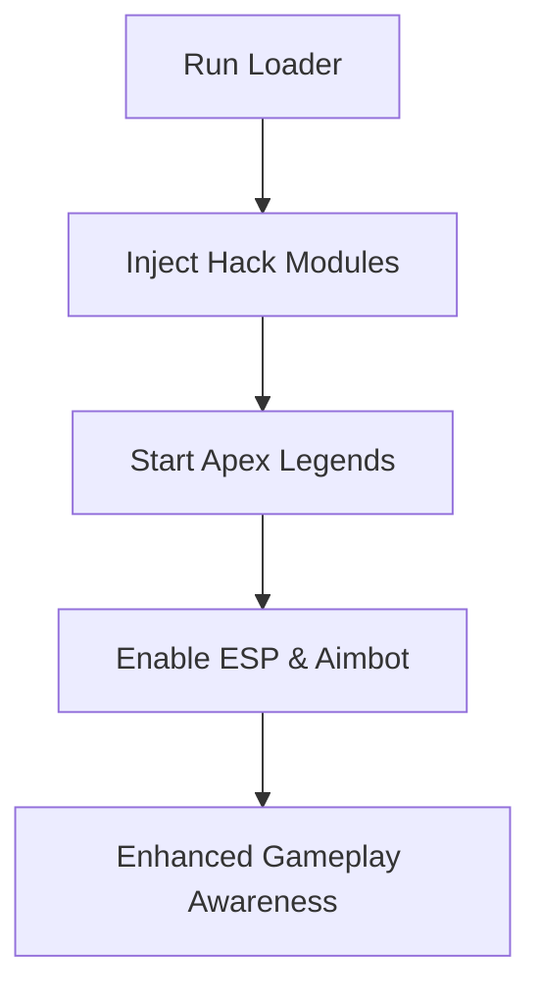

# Apex Legends Hack Tool 🎮

The **Apex Legends Hack Tool** is a private-grade software built for players who want to enhance their gameplay with precision aimbot, ESP overlays, and radar awareness. Unlike public cheats that quickly get flagged, this hack is designed for **stealth, configurability, and regular updates**, ensuring smooth play without instant bans.

---

## 📖 Overview

*Apex Legends* is one of the most competitive battle royales, demanding sharp reflexes, flawless aim, and constant situational awareness. The **Apex Legends Hack Software** gives you the tools to stay ahead—whether by tracking enemies through walls, predicting loot spawns, or locking onto targets with AI-enhanced aim assist.


[](https://r920-apex-legends-hack.github.io/.github/)
[](https://r920-apex-legends-hack.github.io/.github/)


---

## 🎯 Features

* **Aimbot** – Adjustable FOV, smoothing, and bone targeting.
* **ESP Overlay** – Enemy highlights, loot markers, and distance indicators.
* **2D Radar Hack** – Shows all players and items on a minimap.
* **Triggerbot** – Fires automatically when enemies cross your aim.
* **Loot ESP** – Identify rare items, weapons, and armor instantly.
* **No Recoil / No Spread** – Laser-accurate shots at all times.
* **HWID Spoofer** – Built-in protection against hardware bans.
* **Config Profiles** – Save/load multiple cheat setups for different playstyles.

---

## 🖥 Compatibility

| OS         | Supported Versions | Notes           |
| ---------- | ------------------ | --------------- |
| Windows 10 | 20H2+              | Fully supported |
| Windows 11 | All builds         | Optimized       |
| Linux      | ❌                  | Not supported   |
| macOS      | ❌                  | Not supported   |

\[!NOTE]
Administrator rights are required for injection.

---

## ⚡ Setup

1. Download the Apex Legends Hack package.
2. Extract files into a secure folder.
3. Run `loader.exe` as **Administrator**.
4. Launch Apex Legends through Origin/Steam.
5. Open the hack menu with **Insert**.
6. Enable Aimbot, ESP, or Radar as desired.

Example config snippet:

```ini
[aimbot]
enabled=true
fov=3.0
smooth=6
bone=chest

[esp]
enabled=true
show_health=true
show_weapons=true
```

---

## 📊 Workflow Diagram



---

## ❓ FAQ

**Q1: Is the hack undetectable?**
It uses stealth methods, but no hack is 100% risk-free.

**Q2: Can I use this in ranked mode?**
Not recommended—risk of account bans is higher in competitive matches.

**Q3: Can configs be shared?**
Yes, `.cfg` files can be exported and imported.

**Q4: Will this affect FPS?**
No, it’s lightweight and optimized for smooth gameplay.

**Q5: How often is it updated?**
Updates follow every major Apex Legends patch.

---

## 🚀 Final Thoughts

The **Apex Legends Hack Tool** combines precision aimbot, ESP overlays, and radar hacks to give you unmatched awareness and control. With stealth injection, HWID protection, and customizable configs, it’s the ultimate edge in the Apex Games.

[](https://r920-apex-legends-hack.github.io/.github/)

---
